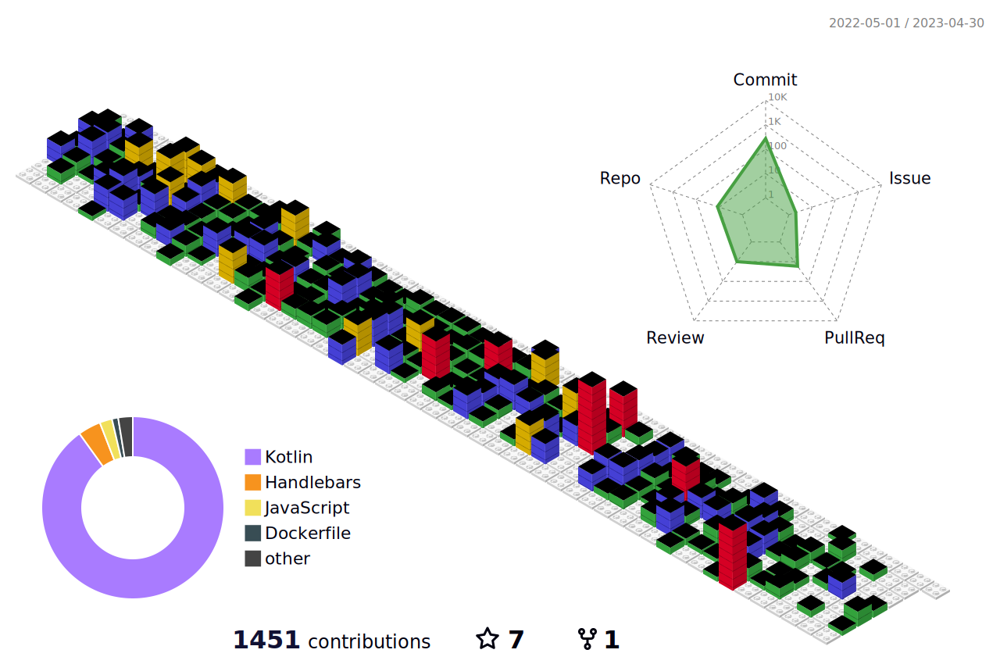

### Hi there, I'm Terry1921 👋 

<!-- **terry0022/terry0022** is a ✨ _special_ ✨ repository because its `README.md` (this file) appears on your GitHub profile. -->
### 🙋🏻‍♂️I’m a mobile developer, father, musician and writer.
- :mortar_board: Computer Systems Engineer (Instituto Tecnológico de Ciudad Valles TecValles)
- Fan of technology, music, soccer and movies
- 👨🏻‍💻 Backend developer since version 2009
- :robot: Android developer since version 2.3 (2011)
- 📃 [Associate Android Developer (Kotlin)][kotlin_credential]

<!--  -->

<!--

  

-->
### Spotify Playing 🎧

### Connect with me 

[][linkedin]
[][twitter]
[][facebook]
[][instagram]

[][google_play]  

## Technology Stack:

 

 

 
And more...
 

--- 

### :zap: GitHub Stats

  <table>
    <tr>
      <td>
        
      </td>
  <td>
        
      </td>
    </tr>   
    <tr>
      <td>
        
      </td>
      <td>
        
      </td>
    </tr>
  </table>

[kotlin_credential]: https://www.credential.net/0f5794dc-2b1f-4c5a-9f78-5ad416529252
[linkedin]: https://www.linkedin.com/in/enrique0022/
[twitter]: https://twitter.com/Terry_rockstar
[facebook]: https://www.facebook.com/terryrockstar/
[google_play]: https://play.google.com/store/apps/dev?id=8219039451853930133
[instagram]: https://www.instagram.com/terrymustdie/

<!--
# Contributions
(in the last 365 days, languages pie based on number of commits)

 -->
